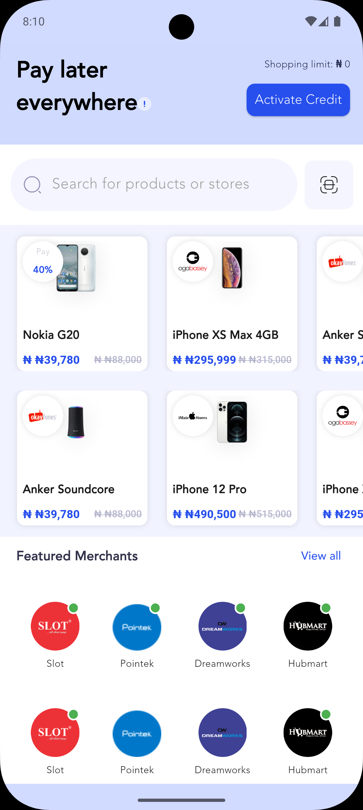

# Credpal Test

A new Flutter project.

## Getting Started

This project is a starting point for a Flutter application.

A few resources to get you started if this is your first Flutter project:

- [Lab: Write your first Flutter app](https://docs.flutter.dev/get-started/codelab)
- [Cookbook: Useful Flutter samples](https://docs.flutter.dev/cookbook)

For help getting started with Flutter development, view the [online documentation](https://docs.flutter.dev/), which offers tutorials, samples, guidance on mobile development, and a full API reference.

## Observations and Assumptions

- **Performance**: Flutter generally provides good performance due to its efficient rendering engine. It is important to avoid unnecessary widget rebuilds to keep the app running smoothly.

- **Code Organization**: It's crucial to maintain a clean separation between the UI and business logic. A well-organized code structure improves maintainability and helps the app scale easily.

- **State Management with BLoC**: The app uses BLoC for state management, which helps in separating business logic from the UI, making the app more scalable and testable.

- **Navigation with GoRouter**: GoRouter is used for handling navigation, providing a declarative and structured approach to managing routes and deep linking within the app.

- **Asset Management**: Some images in the project aren't being used currently, but it is assumed that they could be utilized when data is fetched dynamically from a REST API. This could involve displaying images based on data received from the API, such as product images or user profiles.
